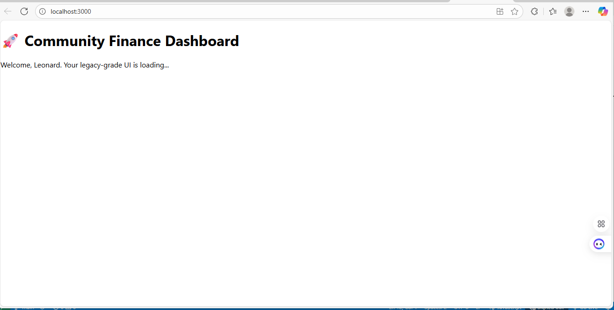
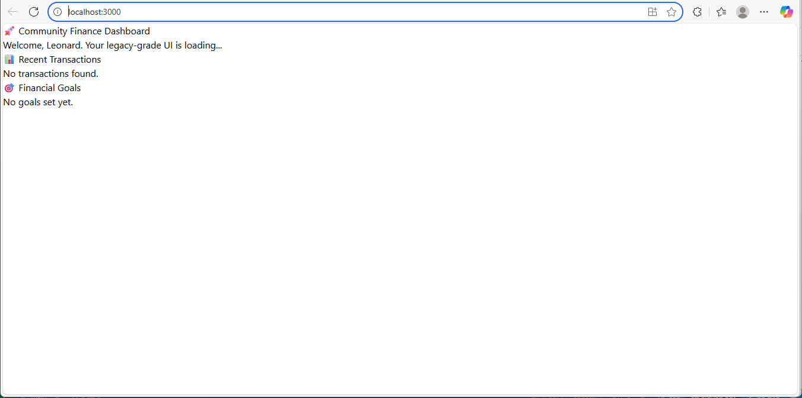
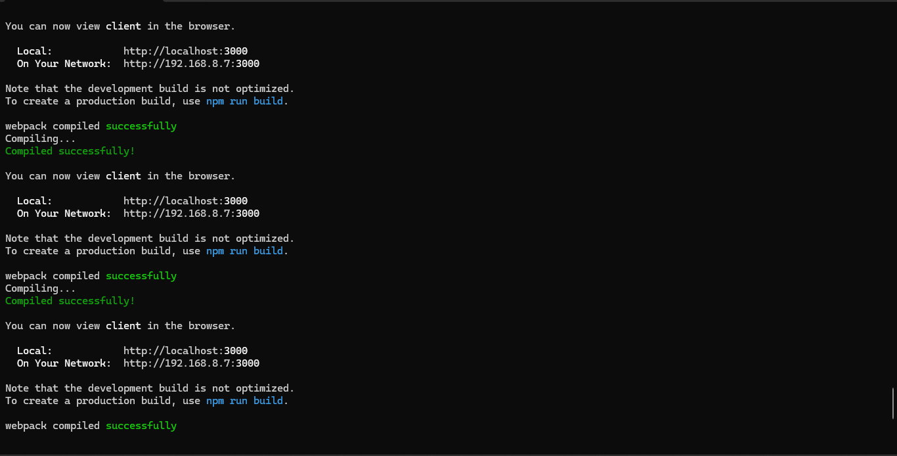

📘 Final README.md — Community Finance Dashboard
Here’s a complete scaffold you can copy into your repo:

markdown
# 🌍 Community Finance Dashboard

A modular, recruiter-facing React app built to track financial goals and transactions in real time. Designed with Tailwind CSS, legacy-grade clarity, and ethical tech storytelling.

---

## 🚀 Live Preview

> Coming soon — deployed via Netlify/Vercel

---

## 📸 Screenshots

### 🏠 Dashboard Welcome


### 💳 Transactions & 🎯 Goals


### ⚙️ Webpack Build Confirmation



---

## 🧱 Tech Stack

- **Frontend**: React, Tailwind CSS
- **Routing**: React Router v6
- **Build Tool**: Create React App (CRA)
- **Deployment**: Netlify / Vercel (optional)

---

## 📊 Features

- Responsive dashboard layout
- Sample data for transactions and goals
- Dynamic progress bars with hover polish
- Modular components (`TransactionList`, `GoalTracker`)
- Legacy-grade UI clarity and recruiter polish

---

## 🧪 Local Setup

```bash
git clone https://github.com/leonardphokane/community-finance-app.git
cd client
npm install
npm start
🛠️ Dev Notes
Tailwind v3.4.1 used for CRA compatibility

Sample data injected via props in Dashboard.jsx

No backend wiring — frontend-only demo

Ready for CI/CD screenshots and submission

👨🏾‍💻 Built By
Leonard Phokane Founder @ UbuntuFlow Oracle & Microsoft Certified AI Associate Afro-futurist Technologist | Ethical AI Advocate

📂 Repo Structure
Code
client/
├── src/
│   ├── components/
│   │   ├── TransactionList.jsx
│   │   └── GoalTracker.jsx
│   ├── pages/
│   │   └── Dashboard.jsx
│   ├── App.jsx
│   └── index.css
└── public/
📬 Contact
📧 leonardphokane1@gmail.com 🌐 LinkedIn

🧠 Legacy-Driven Impact
This project reflects a commitment to modular clarity, ethical design, and Afro-futurist storytelling. Built not just to impress recruiters — but to inspire community uplift.